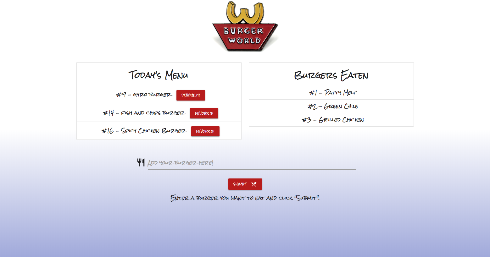

# BURGER WORLD 🍔

_Burger World_ is a burger logging app created using MySQL, Node, Express, Handlebars, and a homemade ORM. This app utilizes the MVC (Model View Controller) design pattern.

## Getting Started

The following instructions will get you a copy of the project up and running on your local machine for development and testing purposes.

### Installation

Please clone and download this folder to your hard disk. You will then navigate to the folder and run `npm install` or `yarn`. This will install the `express`, `express-handlebars` and `mysql` dependencies.

Update the `PORT` settings in `express` if necessary, and type `node server` to get your personal server running. Open your favorite browser and visit `localhost:xxxx` in your browser where `xxxx` will be your port number. 

## Functionality

This app uses `node.js`, `handlebars.js`, `mysql`, and `express` to create a full client and server experience. Enter a burger of your choice in the text field, and click "Submit". Your personal burger will then appear on "Today's Menu" with the option of "Devour It!". If you're feeling hungry, go ahead and click it. Your burger will then be added to the "Burgers Eaten" section. All data is maintained in a MySQL database.

[CLICK HERE](https://stark-woodland-15671.herokuapp.com/) to view a deployed version of the app.